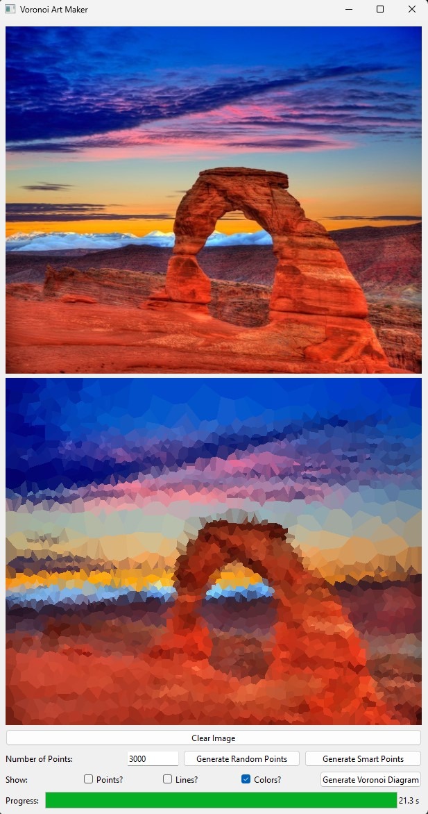
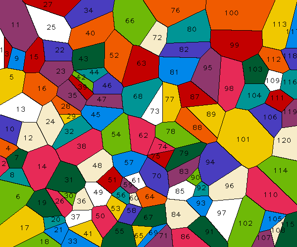

# MastersProject - Voronoi/Superpixel Art Maker

This application can generate Voronoi diagrams, as well as superpixels. These can be generated randomly, or by using a reference image.
Once satisfactory results have been generated, PDF files can be created with a push of a button that can be used with a laser cutter to cut out your result in the real world!

### Nicholas Cage, black & white, 10000 points

### Arches NP, color, 3000 points

### Salisbury Cathedral, color, 4619 superpixels

### Reference Image and laser cutter PDF file for the color white
#### Region numbers are engraved on the back of the pieces

